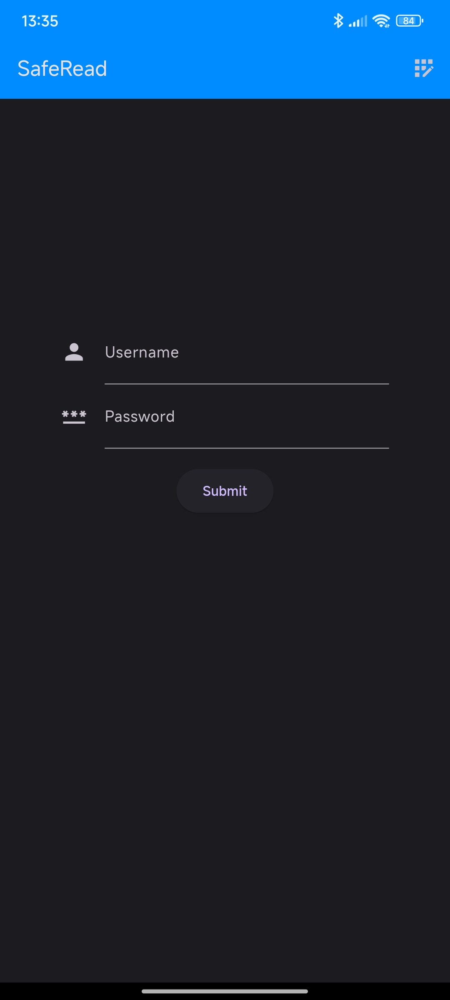
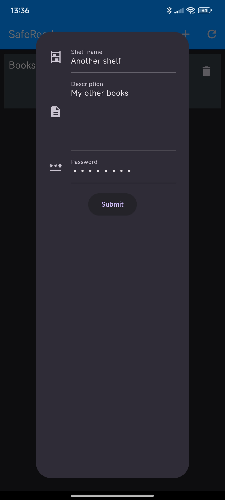
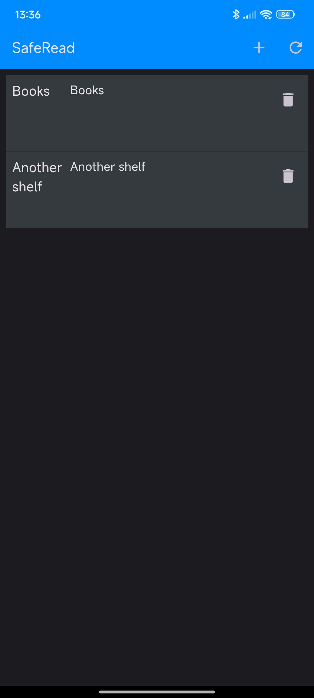
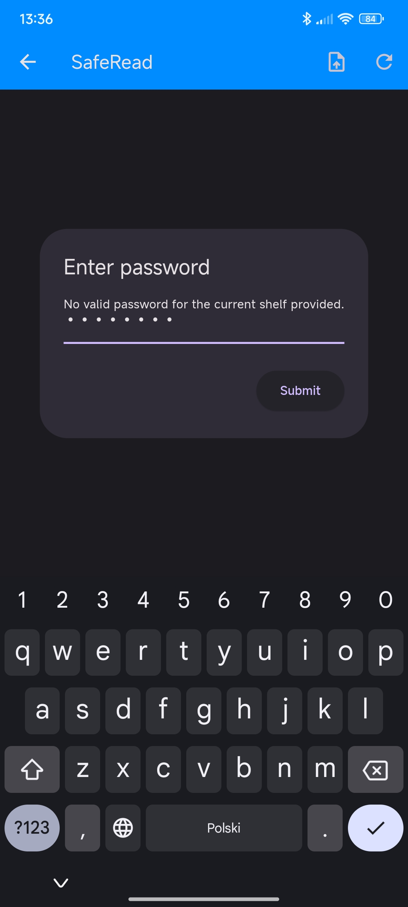
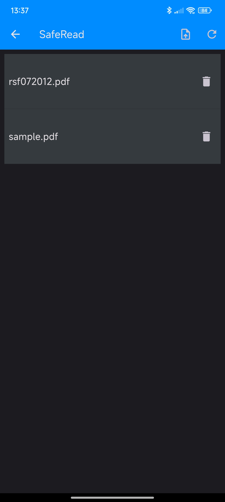
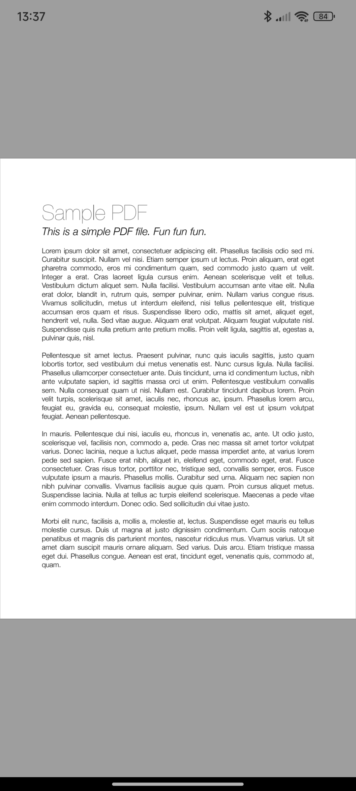

# SafeRead frontend

This repository contains frontend for SafeRead ([backend](https://github.com/Cpitao/safe-read)) - a multi-platform PDF reader written in Flutter that allows uploading PDF files.

The app is created with document confidentiality in mind. You can group documents in "shelves", each shelf encrypted with a password. The password is not stored in any way on the server. When uploading a document to a shelf, it is first encrypted client-side with the shelf password (along with the filename). This way, your documents are safe from both the server administrator viewing them and in case the server is compromised.

The app tracks your current page, which allows you to easily sync between devices.

And remember, use strong passwords!

